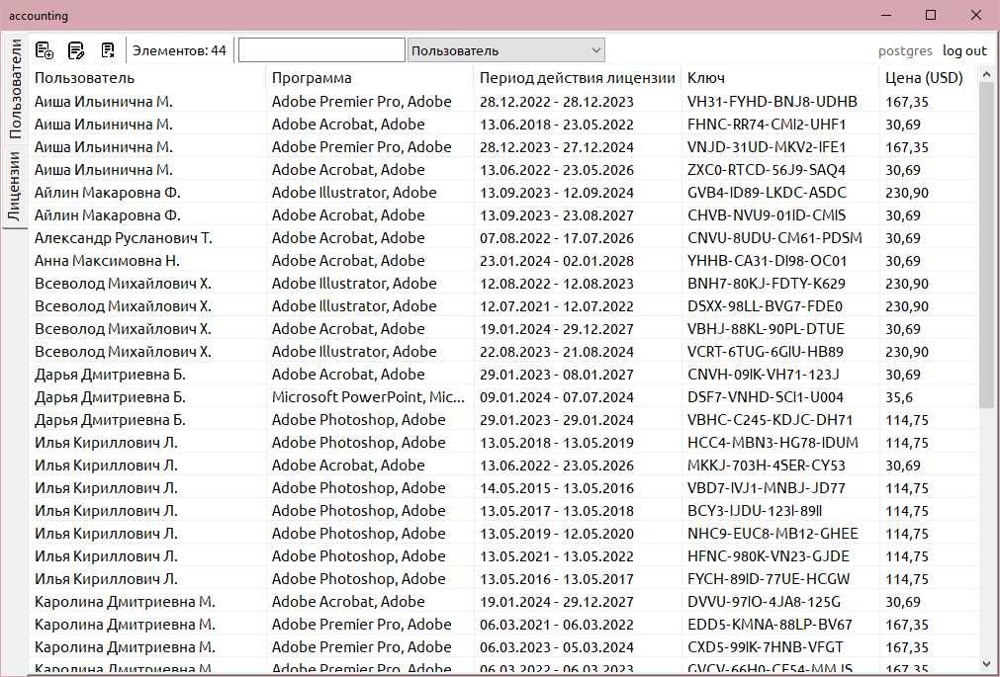
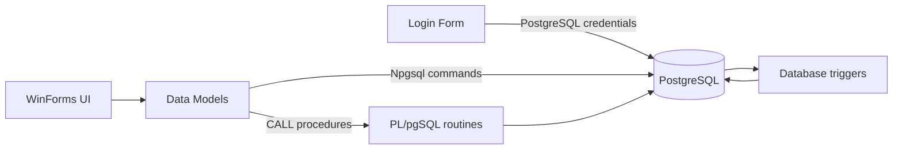
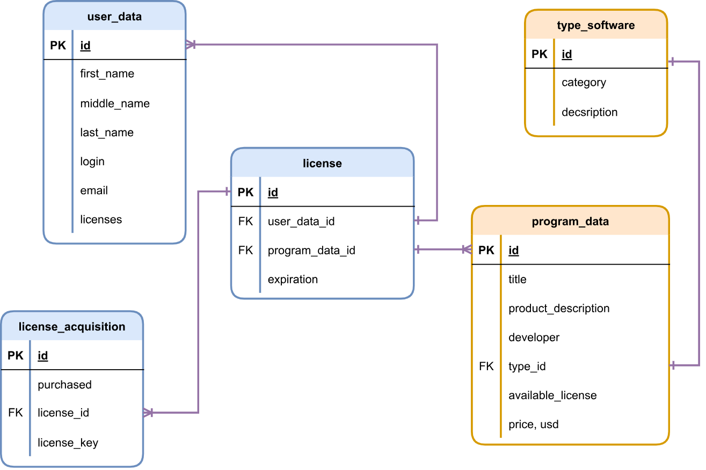
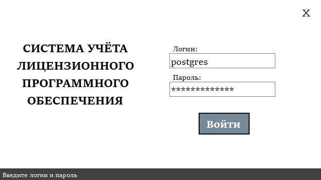
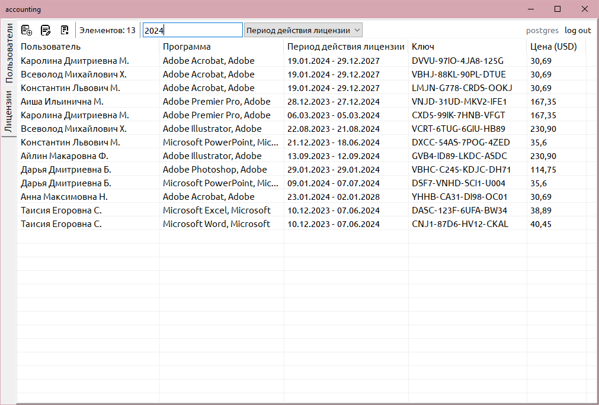
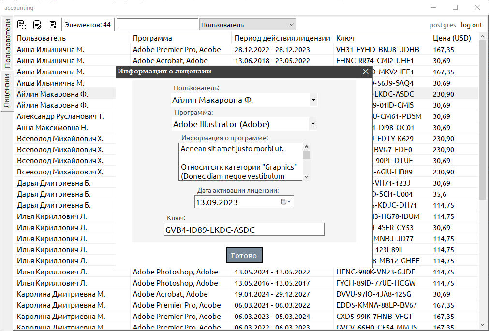
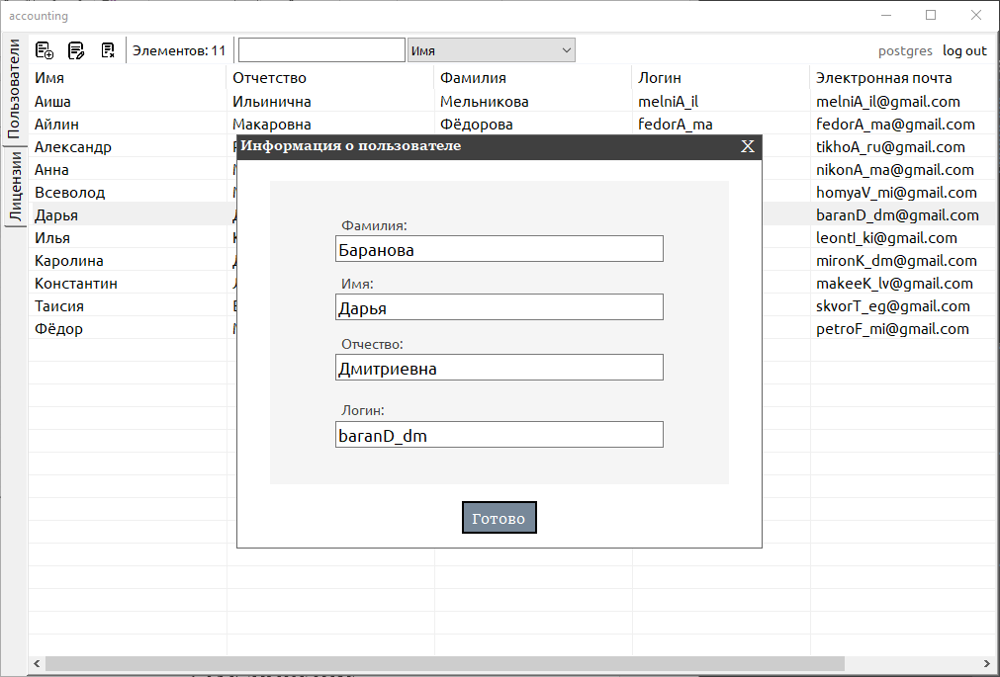

# Software License Accounting System

<p align="center">
  <strong>A PostgreSQL-backed Windows desktop application for tracking software licenses, employee assignments, acquisition history, and expiration dates.</strong>
</p>

<p align="center">
  
  
  
  
</p>

<p align="center">
  
</p>

## Overview

**Software License Accounting System** is a database-oriented desktop application for managing licensed software assigned to company employees.

The project combines a C# Windows Forms client with a PostgreSQL database. Administrators can work with employee and license data through a graphical interface, while PostgreSQL procedures, triggers, generated columns, foreign keys, and role privileges enforce a significant part of the data model and business rules.

The application connects directly to PostgreSQL through Npgsql and uses the credentials entered in the login window. PostgreSQL therefore acts both as the persistent data layer and as the authentication/authorization boundary.

## Features

- PostgreSQL-backed software license accounting
- Employee data management
- License acquisition and assignment management
- License key and purchase-date tracking
- Automatic expiration-date calculation
- Software categories and per-program license duration
- Automatic assignment of software from the `Default` category to new employees
- Automatic employee license counters
- Ascending and descending sorting by table columns
- Field-specific search in employee and license views
- PostgreSQL role-based access model
- PL/pgSQL stored procedures and trigger functions
- Parameterized database commands through Npgsql
- PostgreSQL backup included with the project

## Architecture



The desktop client is intentionally thin. It displays records, collects user input, performs sorting and filtering, and sends parameterized commands to PostgreSQL.

Employee CRUD operations are implemented with SQL commands in `UserData`, while license insert, update, and delete operations call database-side procedures such as:

```text
insert_license_data
update_license_data
delete_license_data
```

This keeps the more complex license-management rules close to the data they modify.

## Database model

<p align="center">
  
</p>

The database contains five core tables:

| Table | Responsibility |
|---|---|
| `user_data` | Employee name, login, generated email, and license count |
| `program_data` | Software title, description, developer, type, license duration, and price |
| `type_software` | Software categories |
| `license` | Assignment of a software product to an employee and its expiration date |
| `license_acquisition` | Purchase date and license key history for an assignment |

The central `license` table connects employees with software products. Acquisition records are stored separately, allowing purchase and key history to be represented independently from the current employee-to-program relationship.

UUID primary keys are generated with PostgreSQL's `uuid-ossp` extension.

## Database-driven business rules

Several consistency rules are implemented in PostgreSQL rather than duplicated in the GUI.

### Default software assignment

After a new employee is inserted, a trigger finds all programs in the `Default` category and creates the corresponding license assignments automatically.

### Expiration recalculation

When the `available_license` duration of a software product changes, related license expiration dates are adjusted.

Changes to acquisition dates also trigger expiration recalculation for the corresponding license.

### Employee license counter

Insert, update, and delete events on the `license` table automatically maintain the `licenses` counter stored in `user_data`.

### License mutation procedures

The database procedures coordinate license and acquisition updates.

For example, `insert_license_data` checks whether the employee already has a license record for the selected program, creates it when necessary, and only inserts a new acquisition when there is no currently valid license.

`delete_license_data` distinguishes default-category software and handles the difference between deleting the last acquisition of a license and deleting only one acquisition record.

## Authentication and database roles

<p align="center">
  
</p>

The application does not maintain a separate application-user table.

The login and password entered in the UI are used to create a PostgreSQL connection to:

```text
Server=localhost
Port=5432
Database=accounting
```

Access is therefore determined by PostgreSQL privileges.

The database design defines a role-oriented access model with responsibilities such as:

- `user_data_manager` — common employee-data permissions
- `user_data_maker` — employee insert and update operations
- `user_data_breaker` — employee deletion
- `license_editor` — license and acquisition management

This makes the visible application functionality dependent on the privileges of the PostgreSQL role used to sign in.

## User interface

The main window contains two working areas:

- **Licenses** — employee, software, validity period, license key, and price
- **Users** — employee name, login, generated email, and number of assigned programs

Clicking a column header switches between ascending and descending sorting for that field.

The search bar filters the currently displayed records by the field selected in the adjacent dropdown.

### Search

<p align="center">
  
</p>

### Editing license data

<p align="center">
  
</p>

The license form allows the administrator to select an employee and software product, inspect the product description and category, set the activation date, and enter the license key.

### Editing employee data

<p align="center">
  
</p>

Employee records can be created or updated through a dedicated form containing surname, first name, middle name, and login fields.

## Project structure

```text
.
├── Models/
│   ├── LicenseData.cs
│   ├── ProgramData.cs
│   └── UserData.cs
├── Properties/
│   ├── Resources.Designer.cs
│   └── Resources.resx
├── database/
│   └── accounting-demo.sql
├── src/
│   ├── deleteButton.png
│   ├── insertButton.png
│   └── updateButton.png
├── LicenseDataForm.cs
├── LicenseDataForm.Designer.cs
├── LicenseDataForm.resx
├── LoginForm.cs
├── LoginForm.Designer.cs
├── LoginForm.resx
├── MainForm.cs
├── MainForm.Designer.cs
├── MainForm.resx
├── UserDataForm.cs
├── UserDataForm.Designer.cs
├── UserDataForm.resx
├── Program.cs
├── accounting.csproj
└── accounting.sln
```

`Models` contains database-facing entity classes and Npgsql commands. The WinForms files implement the login, main data views, and record-editing dialogs.

The `*.Designer.cs` and `*.resx` files are part of the Windows Forms UI and should remain in the repository.

## Requirements

- Windows
- .NET 7 SDK
- PostgreSQL
- PostgreSQL command-line tools (`createdb`, `pg_restore`) for restoring the bundled dump

The project targets:

```text
net7.0-windows
```

Npgsql `8.0.1` is restored through NuGet.

## Database setup

The repository includes a demo database backup:

```text
database/accounting-demo.sql
```

The `.sql` extension is kept for the existing project file, but the file itself is a **PostgreSQL custom-format dump** and must be restored with `pg_restore`, not executed with `psql`.

For a simple local setup, create an empty `accounting` database and restore the backup without owner and ACL metadata:

```bash
createdb -U postgres accounting
pg_restore \
  -U postgres \
  --no-owner \
  --no-acl \
  -d accounting \
  database/accounting-demo.sql
```

Using `--no-acl` is the easiest portable setup because PostgreSQL roles are cluster-level objects and are not created by a normal database dump.

After the restore, sign in to the application with a PostgreSQL role that has access to the `accounting` database. For a local demonstration, the database administrator role can be used.

> For a production-like role-based setup, create the application roles and grant only the required table, function, and procedure privileges before using the corresponding credentials in the GUI.

## Build and run

Restore NuGet packages:

```bash
dotnet restore
```

Build the project:

```bash
dotnet build -c Release
```

Run the application:

```bash
dotnet run --project accounting.csproj
```

The application expects PostgreSQL to be available on `localhost:5432` and connects to a database named `accounting`.

## Backup and restore

The database design was tested with PostgreSQL's standard backup utilities:

```bash
pg_dump
pg_restore
```

The bundled `database/accounting-demo.sql` file is a custom-format PostgreSQL backup containing the demo database used by the project, including its schema, PL/pgSQL routines, triggers, and sample records.

For a public repository, make sure any committed dump contains only synthetic data and test license keys.

## Current scope

This is an academic database project focused on relational modeling, PostgreSQL automation, role privileges, stored procedures, triggers, and desktop database access.

The current client connects directly to a local PostgreSQL server and is designed as an administrative desktop interface rather than a multi-tier production service.